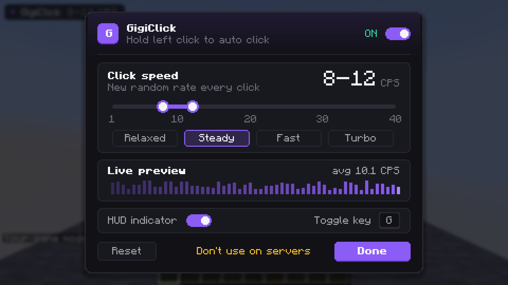

<p align="center"></p>

<h1 align="center">GigiClick</h1>

<p align="center">Hold left click to auto click at a random rate. Minecraft 26.2, Fabric.</p>



## Features
- **Hold to click.** Hold left click and it clicks for you. Let go and it stops.
- **Random CPS range.** Every click lands at a different speed between your min and max.
- **Settings menu.** Slider, presets and a little live preview.
- **HUD.** Shows your CPS while you click. Can be turned off.
- **Stays out of the way.** Pauses in menus, and mining still works like normal.
- **Client-side only.** Nothing needed on the server.

## Controls
| Input | Action |
|---|---|
| Hold left click | Auto click |
| `G` | Turn GigiClick on/off |
| `Right Shift` | Open settings |
| `/gigiclick` | Open settings |
| `/gigiclick cps <min> <max>` | Set the range, e.g. `/gigiclick cps 9 13` |
| `/gigiclick toggle` · `status` | Turn on/off · show status |

Keys can be changed in **Options → Controls → GigiClick**. Settings are saved to `config/gigiclick.json`.

## Requirements
- Minecraft 26.2, Fabric Loader 0.19.5+
- [Fabric API](https://modrinth.com/mod/fabric-api)
- Optional: [Mod Menu](https://modrinth.com/mod/modmenu) for a "Configure" button

## Note
Don't use this on servers. Most of them ban auto clickers.

## Building
The jar ends up in `build/libs/`. `runClientGameTest` runs the in-game tests.
```
./gradlew build
./gradlew runClientGameTest
```

## License
MIT
